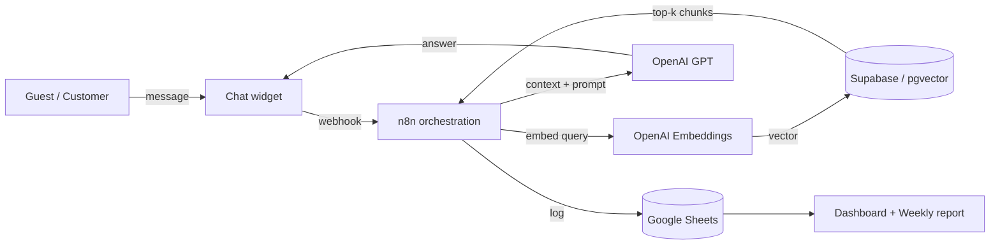

# Timeless AI

**Multi-tenant, RAG-powered virtual assistant platform for hotels, restaurants, clinics, and small hospitality businesses.**

Timeless gives each client a branded AI assistant that answers guest and customer questions 24/7 in natural language, backed by a private knowledge base, plus a management dashboard and automated weekly analytics. The platform is built to onboard a new client and isolate their data without redeploying anything.

> This repository contains the **platform** codebase: public web front-end, the demo experiences, and the shared automation workflows (as exported JSON). Client-specific assets and live credentials are intentionally kept out of source control.

---

## Architecture



**Retrieval-Augmented Generation (RAG) flow**

1. A guest sends a message through the web chat widget.
2. An **n8n** workflow receives it via webhook.
3. The message is embedded with the **OpenAI** embeddings API.
4. A similarity search runs against **Supabase (PostgreSQL + pgvector)**, scoped to that client.
5. The most relevant knowledge-base chunks are returned as context.
6. **GPT** generates a grounded answer, which is sent back to the guest and logged.

**Multi-tenant isolation** — all knowledge lives in a single `documents` table partitioned by a `client_id` field, so each assistant only ever retrieves its own tenant's data.

```
documents ( id, content, embedding vector, client_id, metadata )
```

---

## Tech stack

| Layer | Technology |
|---|---|
| Vector store / DB | **Supabase** — PostgreSQL + `pgvector` extension |
| Embeddings & LLM | **OpenAI API** — `text-embedding-3-small` + GPT chat models |
| Orchestration / backend | **n8n** — webhook- and cron-triggered workflows |
| Client data store | **Google Sheets** (per-client, non-technical friendly) |
| Front-end | Vanilla **HTML / CSS / JavaScript**, CSS-variable design system |
| Hosting / CI-CD | **Cloudflare Pages** (primary) + **Netlify**, auto-deploy on `git push` |

---

## Repository layout

```
├── index.html              Landing page / interactive product demo
├── onboarding.html         Multi-step self-service onboarding form (6 business types)
├── panel.html              Generic client dashboard template
├── baja.html               Unsubscribe page
├── demo/                   Per-vertical demo experiences (hotels, restaurants,
│                           clinics, beauty, real estate)
├── design-explorations/    UI/design system prototypes
├── n8n-workflows/          Automation workflows exported as JSON
│   ├── onboarding-v2.json      Ingest KB → embed → smoke test → welcome email
│   ├── outreach-email.json     Outreach automation
│   ├── follow-up-bot.json      Follow-up sequence
│   └── status-endpoint.json    Onboarding status polling endpoint
├── privacy.html · terms.html   Legal pages
└── manifest.json
```

---

## How onboarding works

A new client fills in `onboarding.html`. On submit, an n8n workflow:

1. Ingests the client's knowledge base into Supabase, chunked and embedded.
2. Runs an automated smoke test against the freshly created assistant.
3. Emails the client a welcome message with their assistant ready to use.

Progress is reported back to the form via a status-polling endpoint, so the user sees each step (`received → ingestion → smoke test → email`) complete in real time.

---

## What this project demonstrates

- **RAG systems** end to end — chunking, embeddings, vector similarity search, context assembly, and grounded generation.
- **Vector databases** — `pgvector` on managed PostgreSQL, with tenant isolation and awareness of free-tier operational constraints (auto-pause mitigation, index strategy).
- **Workflow automation / integration** — event-driven and scheduled orchestration in n8n, wiring together LLM APIs, a database, email, and spreadsheets.
- **Multi-tenant SaaS design** — a single shared infrastructure that isolates each customer by `client_id`, with parameterized front-ends.
- **Cloud & CI/CD** — serverless static hosting with automatic deploys from Git.
- **API integration** — OpenAI, Supabase, Google Sheets, and third-party enrichment services.

---

## Running the front-end locally

The public pages are static and need no build step:

```bash
python -m http.server 8080
# open http://localhost:8080/index.html
```

The workflows in `n8n-workflows/` are reference exports. To run them you need your own n8n instance, a Supabase project with `pgvector` enabled, and an OpenAI API key. All live endpoint hosts and credentials are placeholders — set your own via environment variables / n8n credentials.

---

## Notes

- No credentials are committed to this repository. Secrets are managed as n8n credentials and environment variables, never in source.
- Client-specific deployments (branded assistant, private data, per-client workflows) live outside this repo.

---

*Built by Matías Dutli.*
